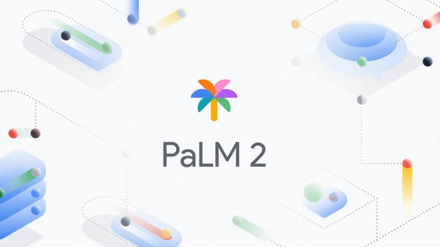

# Project X 🌐🤖

Welcome to Project X 👋. 

This project seamlessly integrates LangChain and Google Palm 2 LLM to provide you with a unique and powerful chatbot experience.




### Explore the Boundless Possibilities 🚀🌴

## 1. PDF Wizardry with LangChain 📚🔗
Tap into the magic of LangChain as it transforms your PDF documents into a treasure trove of insights. Simply upload your PDFs, and watch as the intelligent system, powered by Google's Palm 2 LLM, answers your questions with precision and flair.

## 2. Journey into AI Wonderland with Palm 2 LLM 🌟🤖
Embark on an interactive adventure with Google's Palm 2 Language Model. Engage in dynamic conversations, generate creative content, and witness the wonders of natural language processing through a user-friendly interface.


### Embrace the Features 🌈🔍
- **Seamless PDF Interaction**: Pose questions about your PDFs and receive clear and concise answers effortlessly.
- **State-of-the-Art Language Model**: Harness the power of Google's Palm 2 for a spectrum of tasks from content generation to natural language processing.
- **User-Centric Interface**: Navigate with ease, making AI interaction accessible and enjoyable for everyone.

### Ready to Soar? Let's Begin! 🌐🚀
Unleash the full potential of machine learning and artificial intelligence.  


### Installation Guide 🛠️💻
To install the required dependencies, execute the following command in your terminal:

```bash
pip install -r requirements.txt
```


### Configuration Setup 🔐📝
Create a `.env` file in the project root or/and add the following content, replacing placeholders with your actual API keys:

```env
GOOGLE_API_KEY='Enter Your Palm Api Here' # You can create one from makersuite.google.com
PINE='Enter Your Pine Cone Api Here' # You can create one from the official website of Pinecone pinecone.io
```


In the Pincone.py file, Specify your index name from the pinecone website. Also mention your environment name:

```bash
 pinecone.init(
        api_key=pine_api,
        environment='Specify Your Environment Name'
    )
```


### Launch the AI Symphony 🎶🚀
To start the main Streamlit app, run the following command:

```bash
streamlit run 🏦Home.py
```


### Important Note 📌📘
Make sure to create a folder named **Books** and place the document (PDF you need to query) inside it.

Prepare to be amazed by the wonders of AI with Project X!
